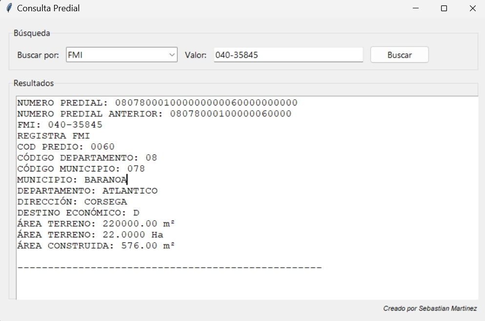

# Manual de Usuario - Consulta Predial

## Requisitos de Funcionamiento
1. Tener el archivo ejecutable `ConsultaPredial.exe`
2. Tener el archivo `predios.csv` en la misma carpeta que el ejecutable
3. Ambos archivos deben estar en la misma carpeta para que el programa funcione correctamente

## ¿Cómo Realizar Consultas?

### Inicio del Programa
1. Hacer doble clic en `ConsultaPredial.exe`
2. Se abrirá una ventana con la interfaz de consulta

### Tipos de Consulta
El programa permite dos tipos de búsqueda:

1. **Por NUMERO PREDIAL (30 dígitos)**
   - Seleccionar "NUMERO PREDIAL" en el menú desplegable
   - Ingresar el número completo o parcial
   - Ejemplo: "080780004000000000679000000000"
   - La búsqueda funciona con números parciales

2. **Por FMI (Folio de Matrícula Inmobiliaria)**
   - Seleccionar "FMI" en el menú desplegable
   - Ingresar el número de matrícula
   - Ejemplo: "123-45678"
   - La búsqueda funciona con números parciales

### Resultados de la Búsqueda
Cada consulta mostrará:
- NUMERO PREDIAL (30 dígitos)
- NUMERO PREDIAL ANTERIOR
- FMI (Folio de Matrícula)
- CÓDIGO PREDIO
- CÓDIGO DEPARTAMENTO
- CÓDIGO MUNICIPIO
- MUNICIPIO
- DEPARTAMENTO
- DIRECCIÓN
- DESTINO ECONÓMICO
- ÁREA TERRENO (en m²)
- ÁREA TERRENO (en Ha)
- ÁREA CONSTRUIDA (en m²)

## Ejemplos de Uso

1. **Buscar por Número Predial:**
   - Seleccionar "NUMERO PREDIAL"
   - Escribir "08078" (mostrará todos los predios que empiecen con estos números)
   - Click en "Buscar"

2. **Buscar por FMI:**
   - Seleccionar "FMI"
   - Escribir "123" (mostrará todos los predios cuyo FMI contenga estos números)
   - Click en "Buscar"

## Notas Importantes
- El programa necesita que el archivo CSV esté en la misma carpeta
- Si el archivo CSV no está presente, el programa solicitará seleccionarlo
- Las búsquedas no distinguen entre mayúsculas y minúsculas
- Se pueden realizar búsquedas parciales en ambos tipos de consulta
- Los resultados se muestran en la ventana principal con scroll si hay múltiples coincidencias

## Solución de Problemas
1. Si el programa no abre:
   - Verificar que el archivo CSV esté en la misma carpeta
   - Verificar que el nombre del archivo sea exactamente `predios.csv`

2. Si no muestra resultados:
   - Verificar que el valor ingresado sea correcto
   - Intentar con una búsqueda más general

Descarga del Programa
Google Drive
| Versión | Enlace | Descripción |
|---------|--------|-------------|
| v1.0 | [Descargar](https://drive.google.com/file/d/1TiKMjoCMk0ZebFzlDFOfQrjt6koT_9sD/view?usp=drive_link) | Versión inicial del programa |

Contenido del Archivo Descargado
El archivo ZIP contiene:
ConsultaPredial.exe (Ejecutable del programa)
predios.csv (Base de datos necesaria)

Descarga el archivo ZIP
Extrae todos los archivos a una carpeta
Asegúrate que ConsultaPredial.exe y predios.csv estén en la misma carpeta
Ejecuta ConsultaPredial.exe

Requisitos del Sistema

Windows 7/8/10/11
4 GB de RAM (mínimo)
100 MB de espacio en disco

Notas de la Versión

Versión: 1.0
Fecha de actualización: Noviembre 2024
Tamaño de descarga: 107 MB

Soporte
Para soporte técnico o consultas:

Email: sebas93martinez@gmail.com
GitHub Issues: Reportar un problema

⚠️ Importante: Asegúrate de mantener juntos el ejecutable y el archivo CSV para el correcto funcionamiento del programa.
---
Desarrollado por Sebastian Martinez
